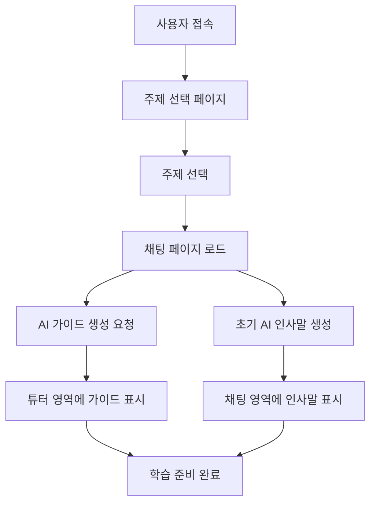
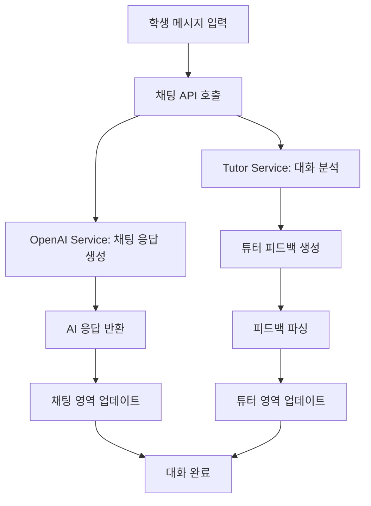

# LLM Classroom 기술문서

## 📋 개요

**LLM Classroom**은 중학생들이 AI(LLM)와의 효과적인 대화를 통해 다양한 학습 주제를 탐구할 수 있도록 돕는 에듀테크 플랫폼입니다. 학생들의 질문 스킬을 향상시키고, 실시간 AI 튜터 피드백을 제공하며, 주제 중심의 체계적인 학습을 지원합니다.

### 🎯 핵심 기능
- **주제별 AI 대화**: 6가지 학습 주제 + 커스텀 주제
- **실시간 튜터 피드백**: 질문 방식과 대화 스킬에 대한 즉각적인 코칭
- **적응형 가이드**: AI 생성 주제별 맞춤 학습 가이드
- **주제 관리**: 학습 주제에서 벗어나지 않도록 하는 스마트 가이드

### 🌐 배포 정보
- **프로덕션 URL**: http://3.107.236.141
- **호스팅**: AWS EC2 (t3.micro, Sydney Region)
- **웹서버**: Nginx + Uvicorn
- **배포일**: 2025년 7월 23일

---

## 🏗 시스템 아키텍처

### 전체 구조도
```
┌─────────────────┐     ┌─────────────────┐     ┌─────────────────┐
│   Client (Web)  │────▶│   AWS EC2       │────▶│  OpenAI API     │
│   Browser       │     │   Nginx:80      │     │  GPT-4o-mini    │
└─────────────────┘     │   FastAPI:8000  │     └─────────────────┘
                        └─────────────────┘
                               │
                        ┌──────┴──────┐
                        │             │
                  ┌─────▼─────┐ ┌─────▼─────┐
                  │  Frontend  │ │  Backend   │
                  │  (Static)  │ │ (FastAPI)  │
                  └────────────┘ └────────────┘
```

### 기술 스택
- **Backend**: FastAPI (Python 3.11)
- **AI Model**: OpenAI GPT-4o-mini
- **Frontend**: Vanilla HTML/CSS/JavaScript
- **웹서버**: Nginx 1.18.0 (리버스 프록시)
- **WSGI**: Uvicorn
- **OS**: Ubuntu 22.04 LTS
- **Architecture**: RESTful API, Service Layer Pattern

---

## 📁 서비스 구조

### 1. API Layer (`/app/api/`)

#### `chat.py` - 메인 채팅 API
```python
POST /api/v1/chat/chat
- 학생의 메시지를 받아 AI 응답과 튜터 피드백을 동시에 생성
- 듀얼 AI 호출: Chat AI + Tutor AI
- Request: { messages, model, topic }
- Response: { response, model, tutor_feedback }
```

#### `initial.py` - 초기 설정 API  
```python
POST /api/v1/chat/initial-message
- 주제별 초기 AI 인사말 생성

POST /api/v1/chat/initial-guide  
- AI 생성 주제별 학습 가이드 제공
```

### 2. Service Layer (`/app/services/`)

#### `openai_service.py` - 채팅 AI 서비스
- **역할**: 학생과의 메인 대화 담당
- **모델**: GPT-4o-mini
- **프롬프트**: 주제별 맞춤 시스템 프롬프트
- **기능**: 
  - 주제 집중 유도
  - 중학생 수준 맞춤 응답
  - 주제 이탈 시 부드러운 리다이렉션

#### `tutor_service.py` - AI 튜터 서비스  
- **역할**: 학생 대화 분석 및 질문 스킬 코칭
- **모델**: GPT-4o-mini
- **분석 항목**: 
  - 주제 관련성 (0순위)
  - 질문의 명확성
  - 맥락 제공 여부
  - 목표 설정 명확성
  - 구조화 정도
  - 후속 질문 가능성

#### `topic_service.py` - 주제 관리 서비스
- **역할**: 주제별 컨텐츠 생성 및 관리
- **기능**:
  - 동적 주제별 가이드 생성 (AI 기반)
  - 초기 인사말 생성
  - 주제별 AI 프롬프트 생성

### 3. Frontend (`/frontend/`)

#### UI 구조 (6:4 비율)
```
┌─────────────────────────────────────────┐
│ 🌍 주제명 학습하기        │ 👩‍🏫 AI 튜터 피드백  │
├─────────────────────────┼─────────────────────┤
│                         │                     │
│    Chat Messages        │   Initial Guide     │
│    (60% width)          │   (40% width)       │
│                         │                     │
│  ┌─ User Message        │  ✨ 잘한 점         │
│  └─ AI Response         │  💡 개선할 점       │
│                         │  🚀 다음 단계       │
│ ┌─────────────────────┐ │  ❓ 추천 질문       │
│ │ [입력창]    [전송]  │ │                     │
│ └─────────────────────┘ │                     │
└─────────────────────────┴─────────────────────┘
```

---

## 🤖 AI 프롬프트 시스템

### 1. 채팅 AI 프롬프트 (OpenAI Service)

#### 시스템 프롬프트 구조
```
당신은 중학생들의 '{topic}' 학습을 도와주는 친근한 AI 튜터입니다.

**학습자 정보**: 중학교 1-3학년 (만 13-15세)
**학습 주제**: {topic}

**주제 관리 규칙** (핵심):
- 학생이 주제와 관련 없는 질문을 하면 부드럽게 주제로 돌려보내세요
- 예: "재미있는 질문이네요! 하지만 오늘은 '{topic}'에 대해 더 깊이 알아볼까요?"
- 완전히 차단하지 말고, 가능하다면 주제와 연결점을 찾아 설명해주세요

**대화 스타일**:
- 친근하고 격려하는 어조
- 중학생 수준의 쉬운 설명
- 답을 직접 제공보다는 힌트 제공
```

#### 동적 주제별 프롬프트
각 주제(사회 문제해결, 과학 탐구, 역사 연구 등)에 따라 특화된 프롬프트가 자동 생성됩니다.

### 2. 튜터 AI 프롬프트 (Tutor Service)

#### 핵심 임무: 주제 집중도 관리
```
**핵심 임무 - 주제 집중도 관리**:
먼저 학생의 메시지가 주어진 학습 주제와 관련이 있는지 확인하세요.

**주제 이탈 감지 및 대응**:
- 학생의 메시지가 학습 주제에서 크게 벗어났다면 부드럽게 주제로 돌려보내세요
- "흥미로운 질문이네요! 하지만 오늘은 '{주제}'에 대해 집중해서 탐구해볼까요?"
- 완전히 차단하지 말고, 주제와 연결할 수 있는 부분이 있다면 연결해주세요
```

#### 분석 프레임워크
```
**학생의 메시지를 다음 관점에서 분석하세요**:

0. **주제 관련성**: 주어진 학습 주제와 관련이 있는가? (최우선)
1. **질문의 명확성**: 구체적이고 명확한가?
2. **맥락 제공**: 충분한 배경 정보와 맥락을 제공했는가?
3. **목표 설정**: 무엇을 알고 싶어하는지 분명한가?
4. **구조화**: 복잡한 문제를 작은 단위로 나누어 질문했는가?
5. **후속 질문**: AI의 답변을 바탕으로 더 깊이 있는 후속 질문을 할 수 있는가?
```

#### 피드백 형식 (고정 구조)
```
**잘한 점**: 학생이 잘한 부분을 구체적으로 칭찬하는 1-2문장
**개선할 점**: 질문 개선 방법 구체적 제안 (주제 이탈시 주제로 돌아가는 방법 포함)
**다음 단계**: 주어진 주제에 대한 구체적이고 실행 가능한 다음 단계 (항상 주제 중심)
**추천 질문**: (항상 주어진 학습 주제와 관련된 질문들만)
1. 첫 번째 추천 질문
2. 두 번째 추천 질문  
3. 세 번째 추천 질문
```

### 3. 가이드 생성 AI 프롬프트 (Topic Service)

#### AI 생성 가이드 프롬프트
```
당신은 중학생들의 '{topic}' 학습을 도와주는 창의적인 교육 전문가입니다.

**상황**: 중학생이 '{topic}' 주제로 LLM Classroom에서 AI와 대화하며 프로젝트를 수행합니다.

**목표**: 중학생이 AI에게 '{topic}'에 대해 효과적으로 질문하여 깊이 있는 답변을 얻을 수 있도록 도움을 주세요.

**응답 형식**:
**가이드 내용**: {topic}에 대한 간단한 소개와 AI와 대화하며 탐구하면 좋은 이유

---시작질문구분선---

**시작 질문 1**: AI에게 할 수 있는 구체적이고 흥미로운 질문
**시작 질문 2**: AI에게 할 수 있는 구체적이고 흥미로운 질문  
**시작 질문 3**: AI에게 할 수 있는 구체적이고 흥미로운 질문
```

---

## ⚙️ 동작 원리

### 1. 학습 세션 시작 플로우



#### 세부 동작
1. **페이지 로드**: 주제 파라미터를 URL에서 추출
2. **가이드 생성**: `POST /api/v1/chat/initial-guide`로 AI 생성 가이드 요청
3. **가이드 파싱**: 구분선 기준으로 가이드 내용과 시작 질문 분리
4. **UI 렌더링**: 마크다운 렌더링 후 인터페이스에 표시

### 2. 대화 처리 플로우



#### 세부 동작
1. **병렬 처리**: 채팅 AI와 튜터 AI가 동시에 처리
2. **채팅 AI**: 
   - 주제별 시스템 프롬프트 적용
   - 주제 이탈 시 리다이렉션
   - 중학생 수준 맞춤 응답
3. **튜터 AI**:
   - 주제 관련성 우선 체크
   - 5가지 분석 기준 적용
   - 구조화된 피드백 생성
4. **UI 업데이트**:
   - 마크다운 렌더링 적용
   - 추천 질문 클릭 시 자동 전송

### 3. 주제 관리 시스템

#### 주제 이탈 감지 로직
```python
# 1. 채팅 AI에서 1차 감지
if message_off_topic(user_message, topic):
    return redirect_to_topic_response(topic)

# 2. 튜터 AI에서 2차 분석
analysis = analyze_topic_relevance(user_message, topic)
if analysis.off_topic:
    feedback.improvements = suggest_topic_return(topic)
    feedback.suggested_questions = generate_topic_questions(topic)
```

#### 주제별 동적 프롬프트
- **실시간 생성**: 각 주제마다 특화된 프롬프트를 AI가 동적 생성
- **개인화**: 학생의 질문 이력을 반영한 맞춤형 가이드
- **적응형**: 대화 진행에 따라 난이도와 방향성 조정

---

## 🔧 핵심 기술 구현

### 1. 듀얼 AI 시스템

#### 병렬 처리 구조
```python
async def chat_with_gpt(request: ChatRequest):
    # 채팅 AI 응답 생성
    response = await openai_service.chat_completion(
        messages, request.model, request.topic
    )
    
    # 튜터 AI 분석 (병렬 실행)
    tutor_feedback = await tutor_service.analyze_conversation(
        messages, last_user_message, response, request.topic
    )
    
    return ChatResponse(
        response=response,
        tutor_feedback=tutor_feedback
    )
```

#### 역할 분리
- **채팅 AI**: 학습 내용 전달, 질문 답변, 주제 가이드
- **튜터 AI**: 메타 학습(학습 방법 개선), 질문 스킬 코칭

### 2. 지능형 프롬프트 엔지니어링

#### 계층적 프롬프트 구조
```
레벨 1: 기본 역할 정의 (AI 튜터, 중학생 대상)
레벨 2: 주제별 특화 (동적 생성)
레벨 3: 상황별 적응 (주제 이탈 감지 등)
레벨 4: 개인화 (학생별 학습 이력 반영)
```

#### 프롬프트 최적화 기법
- **Few-shot Learning**: 구체적인 응답 예시 제공
- **Chain of Thought**: 단계적 사고 과정 유도
- **Self-consistency**: 일관된 피드백 형식 보장

### 3. 실시간 피드백 시스템

#### 구조화된 피드백 파싱
```python
def _parse_feedback(self, feedback_text: str) -> Dict[str, Any]:
    # 정규식 기반 강건한 파싱
    sections = {
        "strengths": r"(\*\*잘한 점\*\*|잘한 점)[:：]?\s*(.*?)(?=\*\*개선할 점\*\*|...)",
        "improvements": r"(\*\*개선할 점\*\*|개선할 점)[:：]?\s*(.*?)(?=\*\*다음 단계\*\*|...)",
        "next_steps": r"(\*\*다음 단계\*\*|다음 단계)[:：]?\s*(.*?)(?=추천 질문|...)",
        "questions": r"(\*\*추천 질문\*\*|추천 질문)[:：]?\s*(.*?)$"
    }
```

#### 시각적 피드백 시스템
- **실시간 업데이트**: 대화와 동시에 피드백 표시
- **인터랙티브 요소**: 추천 질문 클릭 시 자동 전송
- **시각적 강조**: 색상과 아이콘으로 피드백 유형 구분

---

## 📊 시스템 성능 및 최적화

### 1. 응답 속도 최적화
- **병렬 처리**: 채팅 AI와 튜터 AI 동시 실행
- **모델 선택**: GPT-4o-mini 사용으로 속도와 품질 균형
- **토큰 최적화**: max_tokens 제한으로 응답 시간 단축

### 2. 비용 효율성
- **GPT-4o-mini**: GPT-4 대비 90% 비용 절감, GPT-3.5-turbo 대비 성능 향상
- **프롬프트 최적화**: 불필요한 토큰 사용 최소화
- **스마트 캐싱**: 주제별 가이드 로컬 캐싱

### 3. 확장성
- **모듈형 설계**: 서비스 단위 독립적 확장 가능
- **API 기반**: 프론트엔드-백엔드 분리로 다양한 클라이언트 지원
- **주제 확장**: 새로운 학습 주제 쉽게 추가 가능

---

## 🔒 보안 및 안정성

### 1. API 보안
- **환경 변수**: OpenAI API 키 등 민감 정보 환경 변수 관리
- **입력 검증**: 사용자 입력에 대한 기본적인 검증
- **에러 핸들링**: 예외 상황에 대한 안정적인 처리

### 2. 컨텐츠 안전성
- **주제 제한**: 학습 주제 범위 내에서만 대화 진행
- **연령 적합성**: 중학생 수준에 맞는 내용 필터링
- **교육적 가치**: 모든 응답이 교육적 목적에 부합하도록 설계

---

## 🚀 향후 개선 계획

### 1. 기능 확장
- **교사 대시보드**: 학생 학습 현황 모니터링
- **학습 이력 저장**: 개인별 학습 진도 및 성취도 추적
- **협업 기능**: 학생 간 질문 공유 및 피어 러닝

### 2. 기술 개선
- **음성 인터페이스**: 음성 입력/출력 지원
- **멀티모달**: 이미지, 동영상 등 다양한 미디어 지원
- **개인화 AI**: 학생별 학습 스타일에 맞춤형 AI 튜터

### 3. 성능 최적화
- **캐싱 시스템**: Redis 등을 활용한 응답 캐싱
- **데이터베이스**: 사용자 정보 및 대화 이력 영구 저장
- **로드 밸런싱**: 다중 인스턴스 운영으로 확장성 확보

---

## 🔗 배포 및 운영

### 1. AWS 배포 구성
- **인스턴스**: EC2 t3.micro (프리티어)
- **IP 주소**: 3.107.236.141 (Elastic IP)
- **리전**: ap-southeast-2 (Sydney)
- **보안 그룹**: HTTP(80), HTTPS(443), SSH(22), Custom TCP(8000)

### 2. 서비스 관리
```bash
# 서비스 상태 확인
sudo systemctl status llm-classroom

# 서비스 재시작
sudo systemctl restart llm-classroom

# 로그 확인
sudo journalctl -u llm-classroom -f
```

### 3. 업데이트 프로세스
```bash
# 코드 업데이트
cd ~/llm_classroom_proto1
git pull origin main

# 의존성 업데이트
source venv/bin/activate
pip install -r requirements.txt

# 서비스 재시작
sudo systemctl restart llm-classroom
```

### 4. 모니터링
- **Nginx 로그**: `/var/log/nginx/`
- **애플리케이션 로그**: `journalctl -u llm-classroom`
- **시스템 리소스**: `htop`, `df -h`

---

## 📁 관련 문서

- **[AWS 배포 기술 문서](AWS_DEPLOYMENT_TECHNICAL_GUIDE.md)**: 상세한 배포 과정 및 트러블슈팅 가이드
- **[AWS 배포 가이드](AWS_DEPLOYMENT_GUIDE.md)**: 단계별 배포 방법
- **[GitHub 리포지토리](https://github.com/jjhmonolith/llm_classroom_proto1)**: 소스 코드

---

## 📝 결론

LLM Classroom은 중학생들의 AI 활용 능력 향상을 목표로 하는 혁신적인 에듀테크 플랫폼입니다. 듀얼 AI 시스템, 지능형 주제 관리, 실시간 피드백 등의 핵심 기능을 통해 학생들이 효과적으로 AI와 대화하며 학습할 수 있는 환경을 제공합니다.

현재 AWS EC2에 성공적으로 배포되어 운영 중이며, 지속적인 개선과 확장을 통해 더 나은 교육 경험을 제공할 예정입니다.

**마지막 업데이트**: 2025년 7월 23일

특히 GPT-4o-mini를 활용한 비용 효율적이면서도 고품질의 AI 서비스와, 교육학적 원리에 기반한 체계적인 피드백 시스템이 이 플랫폼의 핵심 경쟁력입니다.

---

*작성일: 2025년 1월 23일*  
*버전: 1.0*  
*작성자: LLM Classroom 개발팀*